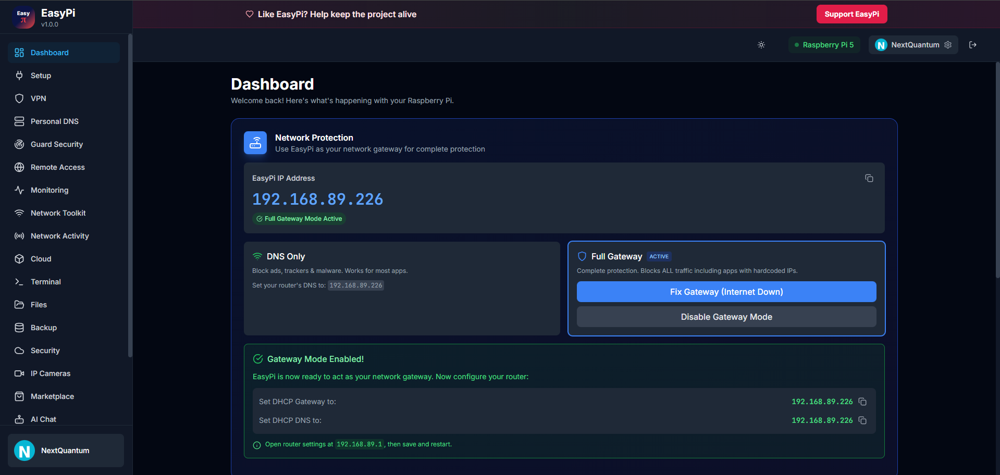
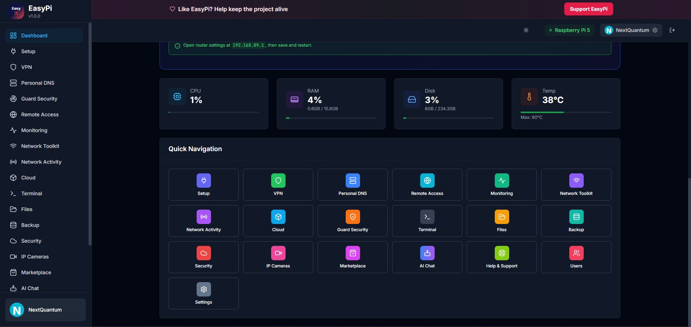

<div align="center">


# EasyPi

**The all-in-one web dashboard for your Raspberry Pi.**  
Monitor, secure, and control everything — no SSH required.

<br/>

[](LICENSE)
[](https://www.python.org/)
[](https://reactjs.org/)
[](https://fastapi.tiangolo.com/)
[](https://www.typescriptlang.org/)
[](https://www.raspberrypi.com/)

<br/>

[🇬🇧 English](#-english) · [🇷🇺 Русский](#-русский) · [🇩🇪 Deutsch](#-deutsch)

</div>

---

## 📸 UI Preview

| | |
|:-:|:-:|
|  |  |

More screenshots: [`docs/SCREENSHOTS.md`](docs/SCREENSHOTS.md)

---

# 🇬🇧 English

## � At a Glance

| 🖥️ Live Dashboard | 🔐 Security Suite | 📵 Parental Control |
|:-:|:-:|:-:|
| Real-time CPU, RAM, temperature | 2FA · PiGuard Scanner · Firewall | Block 40+ streaming apps & all bypass attempts |

| 🤖 AI Models | 🌐 VPN Management | 💾 Backup |
|:-:|:-:|:-:|
| Local LLMs via Ollama (Qwen 2.5 7B · Llama 3.1 8B · DeepSeek-R1 14B) | WireGuard + Tailscale with QR codes | Scheduled backups with one-click restore |

> ⚠️ **Status:** active development.  
> EasyPi is officially tested on **Raspberry Pi OS Lite 64-bit (Debian Trixie)**.  
> Some features may behave differently depending on Raspberry Pi model, network, and system configuration.

---

## ✨ Features

### 🖥️ Dashboard & Real-Time Monitoring

- Live metrics: **CPU · RAM · Temperature · Disk**
- **Network activity** (RX/TX traffic graphs)
- System services status at a glance
- Beautiful **historical charts** for all metrics

---

### 🚀 One-Click Service Management

- Install **WireGuard,Tailscale,Ollama** — in one click
- **Curated bundles**: Media Server · Smart Home · Monitoring
- **Service catalog** with detailed descriptions and state tracking

---

### 🔐 Enterprise-Grade Security

| Feature | Details |
|---|---|
| 2FA | TOTP-based two-factor authentication |
| Session auth | Secure `httpOnly` + `SameSite` cookies + JWT (7-day lifetime) |
| Session management | Per-device tracking & one-click revocation |
| PiGuard Scanner | Automated vulnerability detection |
| Firewall | UFW / iptables management |
| SSL/TLS | Full certificate support |
| CSRF protection | All state-mutating operations protected |
| Rate limiting | API brute-force protection |

**🧭 Full Gateway Mode** — ensures the Pi stays the network gateway:
- Auto-fix gateway routing loops (self-route recovery)
- Persistent IP forwarding across reboots
- NAT survives proxy restarts

---

### 📵 Parental Control & Streaming Blocker

> **DNS-based protection** — each device shows `DNS active / stale / not seen` status so you can verify protection at a glance.

**40+ blocked services:** YouTube · Netflix · TikTok · Instagram · Facebook · WhatsApp · Telegram · Discord · Twitch · Spotify · Amazon Prime · Disney+ · HBO Max · Hulu · Reddit · Twitter · Roblox · Fortnite · Steam · Epic Games · and more.

**Multi-layer blocking engine:**

| Layer | What it blocks |
|---|---|
| DNS | All known domains + CDN endpoints |
| ASN/IP | Hardcoded IPs (e.g. AS2906 for Netflix) |
| DoH/DoT kill | Encrypted DNS bypass prevention |
| Ports (iptables) | OpenVPN · IPSec · Tor · PPTP · Shadowsocks · SOCKS |

**Bypass Protection (auto-enabled):** 170+ VPN / DoH / Tor / Proxy domains + 19 ports

| Provider type | Count |
|---|---|
| VPN providers blocked | 40+ (NordVPN, ExpressVPN, ProtonVPN, Surfshark…) |
| DNS-over-HTTPS providers | 25+ (1.1.1.1, dns.google, cloudflare-dns.com…) |
| Proxy services | 25+ (hide.me, kproxy.com, croxyproxy.com…) |
| Tor exit points | torproject.org · bridges · *.onion |

**Fail-Closed Quarantine** *(optional)* — if a bypass is detected, EasyPi cuts **all internet** for that device until the admin clicks **Restore Internet**. Most effective with **Full Gateway Mode**.

> 📌 WireGuard / Tailscale ports (51820, 51821) are intentionally **not blocked** — EasyPi compatibility.

---

### 🌐 VPN & Remote Access

- **WireGuard VPN** with QR code generation for mobile clients
- **Tailscale Admin API**: auto DNS config, device management, route approval
- **PiCloud**: connect your Pi to cloud infrastructure
- Remote access configuration wizard

---

### 🤖 AI Chat (Local LLMs via Ollama)

- General-purpose AI chat inside the EasyPi interface
- Helps with explanations and draft shell commands
- Runs local models through Ollama (for example: Qwen 2.5 7B, Llama 3.1 8B, DeepSeek-R1 14B)
- Always review suggested commands before running them

---

### 💾 Backup & Restore

- Scheduled automatic backups
- Full system snapshots (configs + databases)
- **One-click restore**
- Configuration versioning

---

### 📁 File Manager & 🔐 Encryption

- Web-based file browser and editor with **syntax highlighting**
- Upload / download files from any browser
- **PiCloud AES-256-GCM encryption** — client-side, password never leaves your browser
  - PBKDF2 with 100,000 iterations (brute-force hardened)
  - Unique Salt + IV per file
  - Magic bytes `EPEC` for easy identification

---

### 💻 Web Terminal

- **WebSSH Terminal** — full shell access in the browser
- Session recording & playback
- Multiple concurrent sessions

---

### 📹 Security Cameras

- RTSP camera integration
- Live view in browser
- Recording management

---

### 🔔 Notifications

- **Push notifications** in browser
- **Email notifications** (SMTP)
- Customizable preferences with quiet-hours support

---

### 📱 PWA & 🔧 Network Tools

- **PWA** — install as a mobile app, works partially offline
- **Port scanner** with range support
- **LAN device discovery**
- **Network speed test**
- **Network topology map**
- **Live traffic monitor**
- **Dark / Light theme**, fully responsive design

---

## 🏗️ Architecture

```
╔══════════════════════════════════════════════════════════╗
║          Frontend  ·  React 18 + TypeScript              ║
║     Vite · Tailwind CSS · Zustand · TanStack Query       ║
║         Recharts · xterm.js · vis-network                ║
╚══════════════════════════╤═══════════════════════════════╝
                           │  WebSocket + REST API
╔══════════════════════════╧═══════════════════════════════╗
║       Backend  ·  FastAPI + Uvicorn (Python 3.9+)        ║
║    SQLAlchemy · Alembic · Pydantic v2 · psutil           ║
║         paramiko (SSH) · go2rtc (WebRTC)                 ║
╚══════════════════════════╤═══════════════════════════════╝
                           │
╔══════════════════════════╧═══════════════════════════════╗
║    SQLite / PostgreSQL · System Services · Raspberry Pi  ║
╚══════════════════════════════════════════════════════════╝
```

### 🛠️ Tech Stack

| Layer | Technologies |
|---|---|
| **Frontend** | React 18 · TypeScript · Vite · Tailwind CSS · Zustand · TanStack Query · Recharts · xterm.js |
| **Backend** | FastAPI · Python 3.9+ · SQLAlchemy · Alembic · WebSockets · psutil |
| **System** | SQLite · UFW/iptables · WireGuard · Tailscale · go2rtc |

---

## 🚀 Quick Start

### Binary Release (Recommended)

1. Check your OS codename on the Raspberry Pi:
```bash
grep VERSION_CODENAME /etc/os-release
uname -m
```
2. Download matching artifacts from [GitHub Releases](https://github.com/NextQuantum/EasyPi/releases):
   - `easypi-full-aarch64-trixie.tar.gz` for Raspberry Pi OS Lite 64-bit (Debian Trixie)
   - `SHA256SUMS.txt`
3. Verify checksum:
```bash
sha256sum -c SHA256SUMS.txt
```
4. Install on Raspberry Pi:

```bash
sudo mkdir -p /opt/EasyPi
sudo tar -xzf easypi-full-aarch64-trixie.tar.gz -C /opt/EasyPi
sudo bash /opt/EasyPi/install.sh --binary
```

> Official support status: **only Trixie is officially supported right now**.

> Installer now creates timestamped backups before replacing managed files (for example: `.env`, `systemd` units, nginx config) using `*.bak-YYYYMMDD-HHMMSS`.

### Requirements

| Requirement | Minimum | Recommended |
|---|---|---|
| Hardware | Raspberry Pi 3B+ | **Pi 4 · 4 GB RAM** |
| Architecture | ARM64 (`aarch64`) | ARM64 (`aarch64`) |
| OS | Raspberry Pi OS Lite 64-bit (Debian Trixie) | Raspberry Pi OS Lite 64-bit (Debian Trixie) |
| Storage | 16 GB SD card | **32 GB SD card** |
| Network | Internet connection | Wired Ethernet |

### Release Compatibility Matrix

| Release artifact | Supported OS |
|---|---|
| `easypi-full-aarch64-trixie.tar.gz` | Raspberry Pi OS Lite 64-bit (Debian Trixie) |

### First Access

```
https://your-pi-address/
  — or —
https://easypi.local/
```

> If the browser shows `Your connection is not private` / `net::ERR_CERT_AUTHORITY_INVALID` on the local EasyPi IP — this is expected with a self-signed certificate. On a trusted home network, click **Proceed to site (unsafe)**.

> `https://easypi.local/` may take 30-90 seconds after install (mDNS/Avahi propagation). If it does not resolve, use the IP URL shown by installer.

> **No default credentials.** On first launch EasyPi shows a setup screen to create your admin account and displays a **recovery token** — save it securely.

### Uninstall

```bash
cd /opt/EasyPi
sudo bash ./uninstall.sh
```

### Troubleshooting

Backend status and logs:

```bash
sudo systemctl status easypi-backend.service --no-pager -l
sudo journalctl -u easypi-backend.service -n 200 --no-pager
sudo journalctl -xeu easypi-backend.service
```

NetProtection and nginx:

```bash
sudo systemctl status easypi-netprotection.service nginx --no-pager -l
sudo journalctl -u easypi-netprotection.service -n 200 --no-pager
```

If backend crashes with `status=255/EXCEPTION`, make sure your system is Debian Trixie and you installed `...-trixie.tar.gz`.

---

# 🇷🇺 Русский

<div align="center">

**EasyPi** — полноценная веб-панель управления Raspberry Pi.  
Мониторинг, безопасность и контроль — без SSH и командной строки.

</div>

---

> ⚠️ **Статус:** активная разработка.  
> EasyPi официально протестирован на **Raspberry Pi OS Lite 64-bit (Debian Trixie)**.  
> Некоторые функции могут работать по-разному в зависимости от модели Raspberry Pi, сети и конфигурации системы.

## ✨ Возможности

### 🖥️ Панель управления и мониторинг

- Живые метрики: **CPU · RAM · Температура · Диск**
- **Сетевая активность** (графики RX/TX)
- Статус системных сервисов
- **История метрик** в виде графиков

---

### 🚀 Управление сервисами

- **WireGuard,Tailscale,Ollama** — в один клик
- **Готовые наборы**: медиасервер · умный дом · мониторинг
- **Каталог сервисов** с описаниями

---

### 🔐 Безопасность

| Функция | Описание |
|---|---|
| 2FA | TOTP двухфакторная аутентификация |
| Сессии | Защищённые cookie `httpOnly` + `SameSite` и JWT (7 дней) |
| Управление сессиями | Отслеживание устройств и мгновенный отзыв |
| PiGuard Scanner | Автоматическое обнаружение уязвимостей |
| Firewall | Управление UFW / iptables |
| SSL/TLS | Полная поддержка сертификатов |
| CSRF защита | Все изменяющие состояние операции |
| Ограничение частоты запросов | Защита API от брутфорса |

**🧭 Режим полного шлюза:**
- Автоматическое исправление маршрутных петель
- Постоянная IP-переадресация после перезагрузки
- NAT не пропадает при перезапуске прокси

---

### 📵 Родительский контроль

> Статус `DNS активен / устарел / не замечен` для каждого устройства.

**40+ заблокированных сервисов:** YouTube · Netflix · TikTok · Instagram · Facebook · WhatsApp · Telegram · Discord · Twitch · Spotify · Amazon Prime · Disney+ · HBO Max · Hulu · Reddit · Twitter · Roblox · Fortnite · Steam · Epic Games · и другие.

| Уровень | Что блокирует |
|---|---|
| DNS | Все известные домены + CDN |
| ASN/IP | Захардкоженные IP (напр. AS2906 для Netflix) |
| DoH/DoT | Зашифрованный DNS |
| Порты | OpenVPN · IPSec · Tor · PPTP · Shadowsocks · SOCKS |

**Защита от обхода:** 170+ доменов + 19 портов

| Тип | Количество |
|---|---|
| VPN-провайдеры | 40+ |
| Провайдеры DoH | 25+ |
| Прокси-сервисы | 25+ |
| Tor | torproject.org · bridges · *.onion |

**Карантин Fail-Closed** — при обнаружении обхода блокирует **весь интернет** до нажатия **«Восстановить интернет»**.

> 📌 Порты WireGuard / Tailscale (51820, 51821) **не блокируются**.

---

### 🌐 VPN и удалённый доступ

- **WireGuard VPN** с QR-кодами для мобильных
- **Tailscale Admin API**: авто-настройка DNS, управление устройствами
- **PiCloud**: подключение к облачной инфраструктуре

---

### 🤖 AI-чат (локальные LLM через Ollama)

- Общий AI-чат прямо в интерфейсе EasyPi
- Помогает с пояснениями и черновиками shell-команд
- Работает с локальными моделями через Ollama (например: Qwen 2.5 7B, Llama 3.1 8B, DeepSeek-R1 14B)
- Любые предложенные команды нужно проверять перед запуском

---

### 💾 Резервное копирование

- Автоматические бэкапы по расписанию
- Полные снимки системы
- **Восстановление одним кликом**

---

### 📁 Файловый менеджер и 🔐 шифрование

- Просмотр и редактирование файлов в браузере
- **AES-256-GCM** (PiCloud) — шифрование на стороне клиента
- PBKDF2 с 100 000 итераций, уникальные Salt + IV

---

### 💻 Терминал · 📹 Камеры · 📱 PWA · 🔧 Сеть

- **Терминал WebSSH** — запись и воспроизведение сессий
- **RTSP видеонаблюдение** — живой просмотр
- **PWA** — установка как мобильное приложение
- **Сетевые инструменты**: сканер портов, обнаружение устройств, спидтест, карта топологии

---

## 🚀 Быстрый старт

### Бинарный релиз (рекомендуется)

1. Проверь кодовое имя ОС на Raspberry Pi:
```bash
grep VERSION_CODENAME /etc/os-release
uname -m
```
2. Скачай подходящие файлы из [релизов GitHub](https://github.com/NextQuantum/EasyPi/releases):
   - `easypi-full-aarch64-trixie.tar.gz` для Raspberry Pi OS Lite 64-bit (Debian Trixie)
   - `SHA256SUMS.txt`
3. Проверь контрольную сумму:
```bash
sha256sum -c SHA256SUMS.txt
```
4. Установи:

```bash
sudo mkdir -p /opt/EasyPi
sudo tar -xzf easypi-full-aarch64-trixie.tar.gz -C /opt/EasyPi
sudo bash /opt/EasyPi/install.sh --binary
```

> Официально поддерживается только **Trixie**.

> Установщик теперь делает резервные копии с меткой времени перед заменой управляемых файлов (например: `.env`, `systemd`-юниты, конфиг nginx) в формате `*.bak-YYYYMMDD-HHMMSS`.

### Требования

| Требование | Минимум | Рекомендуется |
|---|---|---|
| Железо | Raspberry Pi 3B+ | **Pi 4 · 4 ГБ ОЗУ** |
| Архитектура | ARM64 (`aarch64`) | ARM64 (`aarch64`) |
| ОС | Raspberry Pi OS Lite 64-bit (Debian Trixie) | Raspberry Pi OS Lite 64-bit (Debian Trixie) |
| Хранилище | SD карта 16 ГБ | **SD карта 32 ГБ** |
| Сеть | Интернет-подключение | Проводной Ethernet |

### Совместимость бинарных релизов

| Файл релиза | Поддерживаемая ОС |
|---|---|
| `easypi-full-aarch64-trixie.tar.gz` | Raspberry Pi OS Lite 64-bit (Debian Trixie) |

### Первый вход

```
https://адрес-вашего-pi/
  — или —
https://easypi.local/
```

> Если браузер показывает `Подключение не защищено` — нормально для самоподписанного сертификата. Нажми **«Перейти на сайт (небезопасно)»**.

> `https://easypi.local/` может не открываться сразу после установки (mDNS/Avahi). Подожди 30-90 секунд или используй IP-адрес из вывода установщика.

> **Логина и пароля по умолчанию нет.** При первом запуске создашь учётную запись администратора и получишь **токен восстановления** — сохрани его.

### Удаление

```bash
cd /opt/EasyPi
sudo bash ./uninstall.sh
```

### Диагностика

Статус и логи бэкенда:

```bash
sudo systemctl status easypi-backend.service --no-pager -l
sudo journalctl -u easypi-backend.service -n 200 --no-pager
sudo journalctl -xeu easypi-backend.service
```

NetProtection и Nginx:

```bash
sudo systemctl status easypi-netprotection.service nginx --no-pager -l
sudo journalctl -u easypi-netprotection.service -n 200 --no-pager
```

Если бэкенд падает с `status=255/EXCEPTION`, проверь, что у тебя Debian Trixie и установлен `...-trixie.tar.gz`.

---

# 🇩🇪 Deutsch

<div align="center">

**EasyPi** — die zentrale All-in-One-Oberfläche für Ihren Raspberry Pi.  
Überwachung, Sicherheit und Kontrolle — ganz ohne SSH.

</div>

---

> ⚠️ **Status:** aktive Entwicklung.  
> EasyPi wurde offiziell unter **Raspberry Pi OS Lite 64-bit (Debian Trixie)** getestet.  
> Einige Funktionen können je nach Raspberry-Pi-Modell, Netzwerk und Systemkonfiguration unterschiedlich arbeiten.

## ✨ Funktionen

### 🖥️ Übersicht & Echtzeitüberwachung

- Live-Metriken: **CPU · RAM · Temperatur · Festplatte**
- **Netzwerkaktivität** (RX/TX-Graphen)
- Dienste-Status auf einen Blick
- **Historische Diagramme** für alle Metriken

---

### 🚀 Dienstverwaltung mit einem Klick

- **WireGuard,Tailscale,Ollama** — in einem Klick
- **Fertige Pakete**: Medienserver · Smart Home · Überwachung
- **Dienstkatalog** mit ausführlichen Beschreibungen

---

### 🔐 Sicherheit auf Unternehmensniveau

| Funktion | Details |
|---|---|
| 2FA | TOTP-basierte Zwei-Faktor-Authentifizierung |
| Sitzungen | Geschützte `httpOnly`- und `SameSite`-Cookies + JWT (7 Tage) |
| Sitzungsverwaltung | Geräteverfolgung & sofortiger Widerruf |
| PiGuard Scanner | Automatische Schwachstellenerkennung |
| Firewall | UFW / iptables-Verwaltung |
| SSL/TLS | Vollständige Zertifikatunterstützung |
| CSRF-Schutz | Alle zustandsändernden Operationen |
| Anfrageratenbegrenzung | Schutz der API vor Brute-Force-Angriffen |

**🧭 Voller Gateway-Modus:**
- Automatische Korrektur von Gateway-Routing-Schleifen
- Persistentes IP-Forwarding nach Neustarts
- NAT bleibt aktiv bei Proxy-Neustarts

---

### 📵 Kindersicherung & Streaming-Blocker

> Pro Gerät wird `DNS aktiv / veraltet / nicht erkannt` angezeigt.

**40+ gesperrte Dienste:** YouTube · Netflix · TikTok · Instagram · Facebook · WhatsApp · Telegram · Discord · Twitch · Spotify · Amazon Prime · Disney+ · HBO Max · Hulu · Reddit · Twitter · Roblox · Fortnite · Steam · Epic Games · und mehr.

| Ebene | Was blockiert wird |
|---|---|
| DNS | Alle bekannten Domains + CDN-Endpunkte |
| ASN/IP | Hardcodierte IPs (z.B. AS2906 für Netflix) |
| DoH/DoT | Verschlüsselte DNS-Umgehung |
| Ports | OpenVPN · IPSec · Tor · PPTP · Shadowsocks · SOCKS |

**Umgehungsschutz:** 170+ Domänen + 19 Ports

**Fail-Closed-Quarantäne** — bei erkannter Umgehung sperrt EasyPi das **gesamte Internet**, bis **„Internet wiederherstellen“** geklickt wird.

> 📌 WireGuard / Tailscale-Ports (51820, 51821) werden **nicht blockiert**.

---

### 🌐 VPN & Fernzugriff

- **WireGuard VPN** mit QR-Code-Generierung
- **Tailscale Admin API**: automatische DNS-Konfiguration
- **PiCloud**: Raspberry Pi mit Cloud verbinden

---

### 🤖 KI-Assistent · 💾 Backup · 📁 Dateien · 💻 Terminal

- **KI-Chat (lokale LLMs über Ollama)** — allgemeiner KI-Chat mit lokalen Modellen (z. B. Qwen 2.5 7B, Llama 3.1 8B, DeepSeek-R1 14B); Vorschläge vor der Ausführung prüfen
- **Sichern & Wiederherstellen** — geplante Sicherungen, Ein-Klick-Wiederherstellung
- **Dateimanager** mit Code-Editor und AES-256-GCM Verschlüsselung
- **WebSSH-Terminal** — vollständiger Shell-Zugriff im Browser
- **RTSP-Kameras** — Live-Ansicht + Aufnahmeverwaltung
- **PWA** — als mobile App installierbar
- **Netzwerkwerkzeuge**: Port-Scanner, Speedtest, Topologiekarte

---

## 🚀 Schnellstart

### Binär-Release (empfohlen)

1. Codename des Betriebssystems auf dem Raspberry Pi prüfen:
```bash
grep VERSION_CODENAME /etc/os-release
uname -m
```
2. Passende Artefakte aus den [GitHub-Releases](https://github.com/NextQuantum/EasyPi/releases) herunterladen:
   - `easypi-full-aarch64-trixie.tar.gz` für Raspberry Pi OS Lite 64-bit (Debian Trixie)
   - `SHA256SUMS.txt`
3. Prüfsumme prüfen:
```bash
sha256sum -c SHA256SUMS.txt
```
4. Installieren:

```bash
sudo mkdir -p /opt/EasyPi
sudo tar -xzf easypi-full-aarch64-trixie.tar.gz -C /opt/EasyPi
sudo bash /opt/EasyPi/install.sh --binary
```

> Offiziell wird derzeit nur **Trixie** unterstützt.

> Der Installer erstellt jetzt vor dem Überschreiben verwalteter Dateien (z. B. `.env`, `systemd`-Units, nginx-Konfiguration) zeitgestempelte Backups im Format `*.bak-YYYYMMDD-HHMMSS`.

### Anforderungen

| Anforderung | Minimum | Empfohlen |
|---|---|---|
| Hardware | Raspberry Pi 3B+ | **Pi 4 · 4 GB RAM** |
| Architektur | ARM64 (`aarch64`) | ARM64 (`aarch64`) |
| Betriebssystem | Raspberry Pi OS Lite 64-bit (Debian Trixie) | Raspberry Pi OS Lite 64-bit (Debian Trixie) |
| Speicher | 16 GB SD-Karte | **32 GB SD-Karte** |
| Netzwerk | Internetverbindung | Kabelgebundenes Ethernet |

### Kompatibilitätsmatrix (Binär-Releases)

| Release-Datei | Unterstütztes Betriebssystem |
|---|---|
| `easypi-full-aarch64-trixie.tar.gz` | Raspberry Pi OS Lite 64-bit (Debian Trixie) |

### Erster Zugriff

```
https://ihre-pi-adresse/
  — oder —
https://easypi.local/
```

> Wenn der Browser `Verbindung ist nicht privat` zeigt — normal bei einem selbstsignierten Zertifikat. Im vertrauenswürdigen Heimnetz **„Weiter zur Website (unsicher)"** wählen.

> `https://easypi.local/` kann direkt nach der Installation 30-90 Sekunden brauchen (mDNS/Avahi). Falls nicht erreichbar, die IP-URL verwenden.

> **Keine Standard-Anmeldedaten.** Beim ersten Start Admin-Konto erstellen und **Recovery-Token** sichern.

### Deinstallation

```bash
cd /opt/EasyPi
sudo bash ./uninstall.sh
```

### Fehlersuche

Status und Protokolle des Backends:

```bash
sudo systemctl status easypi-backend.service --no-pager -l
sudo journalctl -u easypi-backend.service -n 200 --no-pager
sudo journalctl -xeu easypi-backend.service
```

NetProtection und nginx:

```bash
sudo systemctl status easypi-netprotection.service nginx --no-pager -l
sudo journalctl -u easypi-netprotection.service -n 200 --no-pager
```

Wenn der Backend-Prozess mit `status=255/EXCEPTION` abstürzt, prüfe, ob Debian Trixie läuft und `...-trixie.tar.gz` installiert wurde.

---

<div align="center">

## 📜 Лицензия · Lizenz

Распространяется по **проприетарной лицензии** — см. [LICENSE](LICENSE), [EULA.txt](EULA.txt) и [THIRD_PARTY_LICENSES.md](THIRD_PARTY_LICENSES.md).

---

## 🤝 Участие в проекте

| Как помочь | Действие |
|---|---|
| 🐛 Нашли ошибку? | [Создать Issue](https://github.com/NextQuantum/EasyPi/issues) |
| 💡 Есть идея? | Опишите ваше предложение |
| 🔧 Хотите помочь кодом? | Отправьте Pull Request |
| 📖 Хотите улучшить документацию? | Любые правки приветствуются |
| ⭐ Нравится EasyPi? | Поставьте звезду репозиторию |

---

<sub>Сделано для сообщества Raspberry Pi</sub>

[⬆ Наверх](#easypi)

</div>
