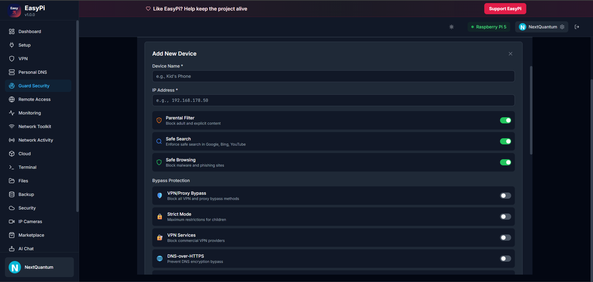
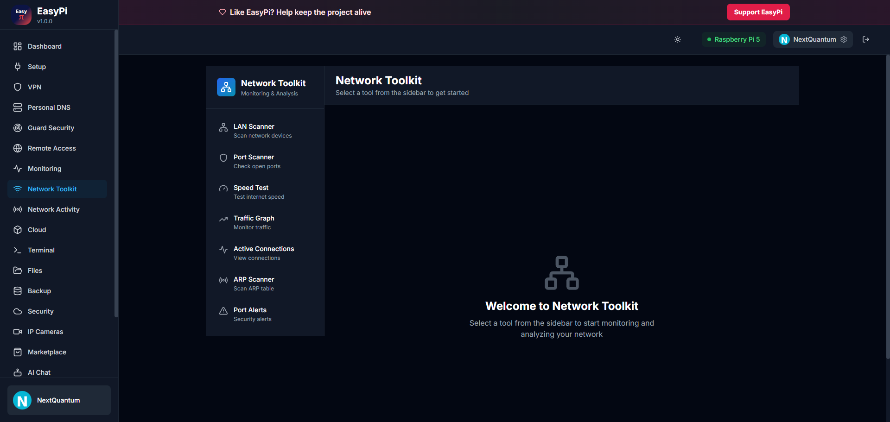
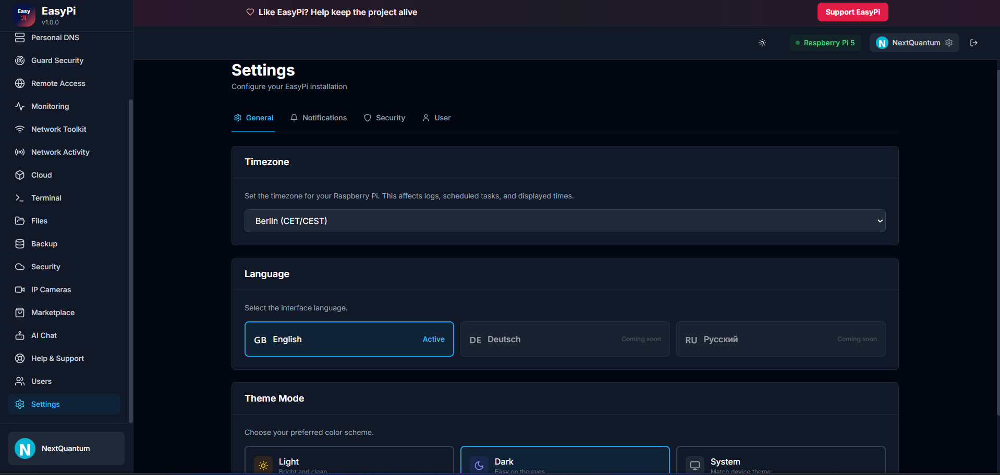
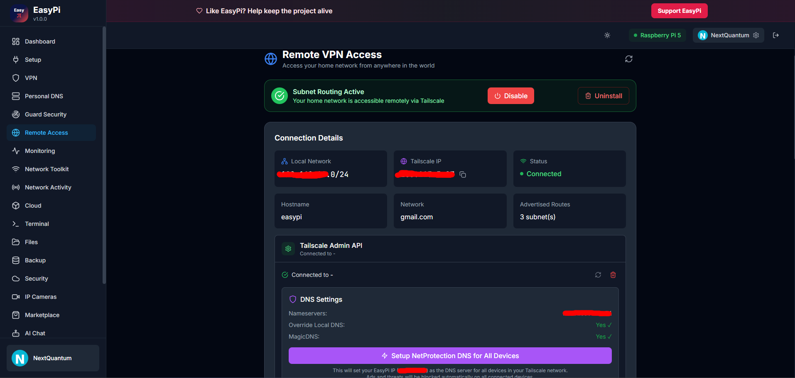
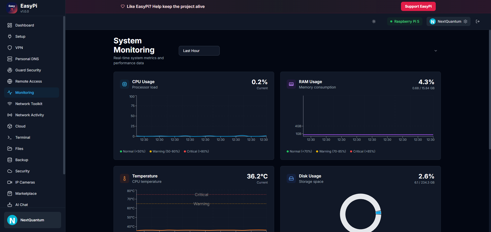

<div align="center">

# EasyPi

### Raspberry Pi Security & Network Control Dashboard

Binary releases only (no source code in this repository)

[](https://github.com/NextQuantum/EasyPi/releases)
[](#install)
[](LICENSE)

</div>

---

## Overview

EasyPi is a web interface for managing Raspberry Pi network protection and home-lab security without working directly in terminal for every task.

What you can do:

- Live dashboard (CPU, RAM, temperature, disk)
- Guard Security and parental controls
- DNS filtering and anti-bypass controls
- VPN and remote access management
- Network tools, monitoring, backups

---

## UI Preview

| Dashboard | Guard Security |
|---|---|
|  |  |

| Network Toolkit | Settings |
|---|---|
|  |  |

| Remote Access | Monitoring |
|---|---|
|  |  |

Full gallery: [docs/SCREENSHOTS.md](docs/SCREENSHOTS.md)

---

## Install

### 1) Download release files

Open [Releases](https://github.com/NextQuantum/EasyPi/releases) and download:

- `easypi-full-aarch64.tar.gz`
- `SHA256SUMS.txt`

### 2) Verify SHA256 (recommended)

Linux/macOS:

```bash
sha256sum easypi-full-aarch64.tar.gz
cat SHA256SUMS.txt
```

PowerShell:

```powershell
Get-FileHash .\easypi-full-aarch64.tar.gz -Algorithm SHA256
Get-Content .\SHA256SUMS.txt
```

### 3) Install on Raspberry Pi

```bash
sudo mkdir -p /opt/EasyPi
sudo tar -xzf easypi-full-aarch64.tar.gz -C /opt/EasyPi
sudo bash /opt/EasyPi/install.sh --binary
```

Open in browser:

- `https://<RASPBERRY_PI_IP>/`

---

## Update

```bash
sudo tar -xzf easypi-full-aarch64.tar.gz -C /opt/EasyPi
sudo bash /opt/EasyPi/install.sh --binary
```

---

## Troubleshooting

Service status:

```bash
sudo systemctl --no-pager -l status easypi-backend easypi-netprotection nginx
```

Live logs:

```bash
sudo journalctl -u easypi-backend -f
sudo journalctl -u easypi-netprotection -f
```

---

## HTTPS Warning (Local IP)

On first local access, browser may show:

- `ERR_CERT_AUTHORITY_INVALID`

This is expected with a local self-signed certificate. On your trusted home LAN, you can continue via browser advanced options.

---

## Notes

- This repository is for binaries and release assets.
- Source code is not published here.

---

## License

Proprietary license: [LICENSE](LICENSE)
